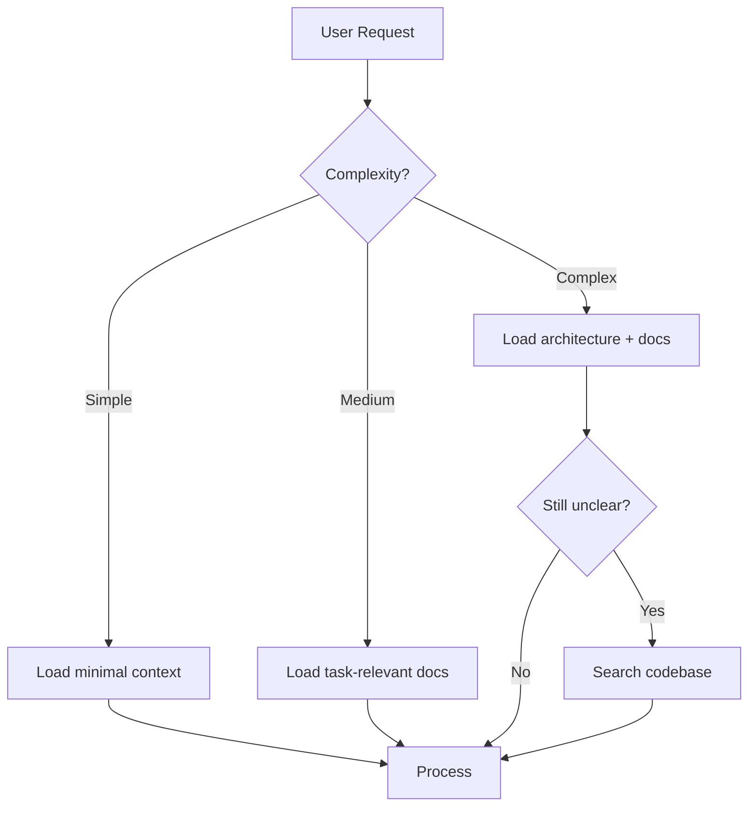

# Context Window Management Strategy

> [!NOTE]
> Large codebases inevitably exceed context windows. This document defines strategies for **intelligent context allocation** rather than brute-force inclusion.

---

## 1. The Context Budget Model

Think of context as a **finite currency**:

```
┌────────────────────────────────────────────────────────────┐
│ Context Window (e.g., 200K tokens)                         │
├────────────────────────────────────────────────────────────┤
│ [System Prompt]  │ [Task Context] │ [Code] │ [Response]   │
│     ~5%          │     ~15%       │  ~60%  │    ~20%      │
└────────────────────────────────────────────────────────────┘
```

**Key Insight**: Every token spent on irrelevant context is a token stolen from reasoning capacity.

---

## 2. Hierarchical Context Loading

### Level 0: Core Identity (Always Loaded)
- `.ai/guidelines/genai_base.md` — Core agent behavior
- Project-specific critical rules

### Level 1: Task-Relevant (Loaded per Task)
- `docs/architecture/*.md` — If touching architecture
- `docs/development/implementation-guide.md` — If implementing features
- Relevant `.ai/prompts/*.md` — Based on task type

### Level 2: File-Specific (Loaded on Demand)
- Source files being edited
- Direct dependencies (imports)
- Related test files

### Level 3: Reference (Loaded Sparingly)
- Similar implementations (for pattern reference)
- Historical context (previous decisions)

---

## 3. Context Compression Techniques

### A. Intelligent Summarization
Before loading a large file, generate a **structural summary**:

```markdown
## File: backend/internal/state/graph_traversal.go
- **Purpose**: BFS traversal to build Git graph visualization
- **Key Functions**:
  - `populateCommits(repo, showAll)` — Main entry, handles HybridStorer
  - `bfsTraverse(startRefs)` — Core BFS logic
- **Key Dependencies**: HybridStorer (for local/remote separation)
- **Lines**: 380
- **Last Modified**: 2025-12-27
```

### B. Outline-First Approach
1. Always use `view_file_outline` before `view_file`
2. Only load specific functions/classes needed
3. Use `view_code_item` for surgical precision

### C. Delta Loading
Track what's already in context:
- Don't reload unchanged files
- Only load diff when reviewing changes

---

## 4. Context Eviction Policies

When approaching limits, evict in this order:

| Priority | What to Evict | Reason |
|----------|---------------|--------|
| 1 (First) | Historical conversation | Older turns less relevant |
| 2 | Reference files already processed | Can re-fetch if needed |
| 3 | Completed task artifacts | Summarize to `walkthrough.md` first |
| 4 (Last) | Current working files | Never evict active editing context |

---

## 5. RAG Integration Patterns

### When to Use RAG
- Searching across 100+ files
- Finding historical decisions/patterns
- Looking up API documentation

### RAG Query Best Practices
```markdown
## Good RAG Queries
- "How is HybridStorer used in graph traversal?"
- "What is the Command interface signature?"
- "Examples of error handling in push.go"

## Bad RAG Queries
- "All files" (too broad)
- "Bug fixes" (too vague)
- Single-word queries without context
```

---

## 6. The "Progressive Disclosure" Pattern



**Principle**: Start with minimal context, expand only when needed.

---

## 7. Context Hygiene Checklist

Before executing a complex task:

- [ ] Do I have the **architecture overview** loaded?
- [ ] Have I loaded the **specific files** I'll modify?
- [ ] Did I check for **existing tests** that define expected behavior?
- [ ] Is there **dead context** I can evict?
- [ ] Have I **summarized** large files instead of loading verbatim?

---

## 8. Implementation for GitGym

### Codebase Size Estimates
| Component | Files | Lines | Priority |
|-----------|-------|-------|----------|
| Backend commands | ~20 | ~4000 | High (active development) |
| Frontend components | ~30 | ~5000 | Medium |
| Documentation | ~30 | ~2000 | Always load relevant subset |

### Recommended Preload Sets
```yaml
task_type: "implement_git_command"
preload:
  - docs/development/implementation-guide.md
  - docs/architecture/codebase-map.md
  - backend/internal/git/engine.go (outline only)

task_type: "fix_visualization_bug"
preload:
  - docs/architecture/state-management.md
  - frontend/src/components/visualization/* (outlines)
  - frontend/src/types/gitTypes.ts
```

