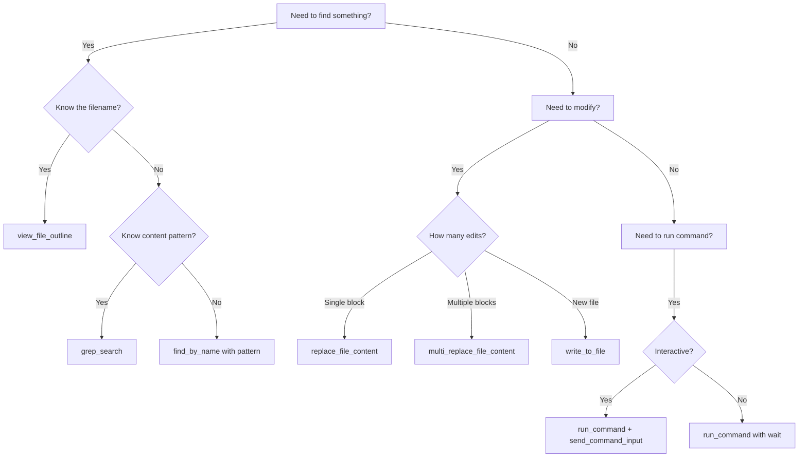

# Tool Mastery & Composition Patterns

> [!NOTE]
> Effective agents don't just *use* tools—they **compose** them into reliable workflows with graceful error recovery.

---

## 1. Tool Usage Principles

### The Three Laws of Tool Use
1. **Verify Before Acting**: Check state before mutation
2. **Fail Fast, Recover Gracefully**: Handle errors explicitly
3. **Minimize Round Trips**: Batch operations when possible

---

## 2. Tool Composition Patterns

### Pattern A: Parallel Independence
When operations don't depend on each other:
```
┌──────────────┐ ┌──────────────┐ ┌──────────────┐
│ view_file A  │ │ view_file B  │ │ grep_search  │
└──────────────┘ └──────────────┘ └──────────────┘
       │                │                │
       └────────────────┼────────────────┘
                        ▼
                   [Process all]
```
**Example**: Reading multiple source files simultaneously

### Pattern B: Sequential Dependency
When each step depends on the previous:
```
find_by_name → view_file_outline → view_code_item → replace_file_content
```
**Example**: Finding, understanding, then editing a function

### Pattern C: Verification Sandwich
Wrap mutations with verification:
```
view_file (before) → replace_file_content → view_file (after)
```
**Example**: Ensure edit was applied correctly

### Pattern D: Fallback Chain
Try preferred method, fall back if failed:
```
if grep_search fails:
    try find_by_name
    if find_by_name fails:
        manual file exploration with list_dir
```

---

## 3. Error Recovery Strategies

### Classification of Errors

| Error Type | Example | Recovery Strategy |
|------------|---------|-------------------|
| **Transient** | Network timeout | Retry with backoff |
| **Input Error** | Wrong file path | Validate inputs, ask user |
| **State Error** | File changed externally | Re-sync state, retry |
| **Logic Error** | Bad regex pattern | Fix pattern, retry |
| **Unrecoverable** | Permission denied | Escalate to user |

### Recovery Template
```markdown
## Error Encountered
- **Tool**: replace_file_content
- **Error**: "TargetContent not found in file"
- **Diagnosis**: File may have been modified since last read
- **Recovery Action**: 
  1. Re-read file with view_file
  2. Locate current content
  3. Retry with updated TargetContent
```

---

## 4. Tool-Specific Best Practices

### File Operations

| Tool | Best Practice |
|------|---------------|
| `view_file` | Use `StartLine`/`EndLine` for large files (>500 lines) |
| `view_file_outline` | Always call first on new files |
| `replace_file_content` | Include surrounding context in TargetContent |
| `multi_replace_file_content` | Use for 2+ non-contiguous edits |
| `write_to_file` | Set `Overwrite: false` unless intentionally replacing |

### Search Operations

| Tool | Best Practice |
|------|---------------|
| `grep_search` | Use `Includes` to scope search |
| `find_by_name` | Use `Type: file` to exclude directories |

### Command Execution

| Tool | Best Practice |
|------|---------------|
| `run_command` | Set appropriate `WaitMsBeforeAsync` for command type |
| `command_status` | Poll with increasing intervals (500ms → 1s → 2s) |
| `send_command_input` | Include newline for command submission |

---

## 5. Efficiency Optimizations

### Batch Reading
```
❌ Bad: Read file1, process, read file2, process, read file3, process
✅ Good: Read file1 + file2 + file3 (parallel), process all
```

### Targeted Edits
```
❌ Bad: Read entire file, rewrite entire file
✅ Good: Read outline, view specific section, edit specific lines
```

### Smart Searching
```
❌ Bad: grep_search with broad query, read all matches
✅ Good: grep_search → filter results → read only relevant matches
```

---

## 6. Tool Selection Decision Tree



---

## 7. Dangerous Operations Checklist

Before executing potentially destructive operations:

- [ ] **Backup exists?** (At least conceptually—can we recover?)
- [ ] **Scope limited?** (Not `rm -rf /`, limited blast radius)
- [ ] **User awareness?** (SafeToAutoRun = false for destructive ops)
- [ ] **Verification planned?** (How will we confirm success?)

---

## 8. Future Tool Enhancements (Proposals)

### Atomic File Operations
```
begin_transaction → [multiple edits] → commit OR rollback
```

### Dry Run Mode
```
run_command(Dry: true) → Shows what would happen without executing
```

### Tool Telemetry
```
Log: { tool: "grep_search", duration_ms: 150, result_count: 12 }
```

