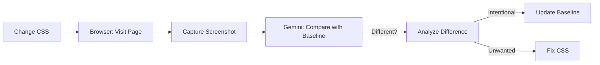

# Multimodal Agent Patterns

> [!IMPORTANT]
> Code is not just text. It is rendered pixels, architecture diagrams, and user flows. An AI agent blind to visuals is working with one hand tied.

---

## 1. Beyond Text-Based Coding

### The Visual Feedback Loop
**Current**: User says "The button is off-center". Agent guesses CSS fixes.
**Gemini**:
1. Agent asks: "Can you provide a screenshot?"
2. Agent **sees** the 5px misalignment.
3. Agent relates visual pixels to CSS classes (`.btn-primary { margin-top... }`).
4. Agent fixes.

---

## 2. Visual Verification Artifacts

### Pattern: "Design-to-Code"
1. **Input**: Figma export or Design Mockup image.
2. **Context**: `tailwind.config.js` or `index.css`.
3. **Action**: Generate Component code that visually matches the image.
4. **Verify**: Capture screenshot of implementation (via browser tool) vs Mockup.

### Pattern: "The Whiteboard Session"
1. Agent needs to architect a system.
2. Tool: `generate_image` (Mermaid -> PNG or actual drawing tool).
3. Agent **draws** the architecture.
4. Agent reviews its own drawing: "Wait, this cycle in the diagram looks wrong."
5. Agent refines code based on the visual model.

---

## 3. Multimodal Debugging

### Screenshot Analysis
- **Error Modals**: OCR the error message from a screenshot (sometimes text logs aren't available for UI crashes).
- **Layout Bugs**: Identify "Z-index fighting" or "Overlapping text" which are invisible in code/logs but obvious in pixels.

### Video/Trace Analysis
- **Reproduction**: Input a screen recording of the bug.
- **Action**: Agent correlates user mouse clicks in video to Event Handlers in code.

---

## 4. Implementation for GitGym

### New Tool Proposal: `capture_screenshot`
(Already exists in browser_subagent, but elevate to first-class Debugging workflow).

### Use Case: Git Graph Verification
The Git Graph is a visual canvas (`<svg>`).
- **Text Assertion**: `expect(node).toBeVisible()` (Fragile, basic)
- **Visual Assertion**:
    1. Agent renders verifying graph.
    2. Agent captures screenshot.
    3. Agent analyzes: "Are the commit nodes topologically sorted? Are branch lines crossing correctly?"
    4. **Self-Correction**: "The merge lines are tangled. I need to adjust the clustering algorithm in `d3` logic."

### Workflow: Visual Regression Check

---

## 5. Input Capabilities
Agents should accept:
- **Screenshots** (`.png`, `.jpg`) for UI bugs.
- **Diagrams** (`.svg`, `.png`) for architecture specs.
- **Audio** (`.mp3`) for voice memos/standup recordings explaining requirements.

---

## 6. Anti-Patterns to Avoid
- **Blind CSS Edits**: Editing styles without ever looking at the result.
- **Alt-Text Coding**: Relying on "A red button" text descriptions instead of seeing the redness.

