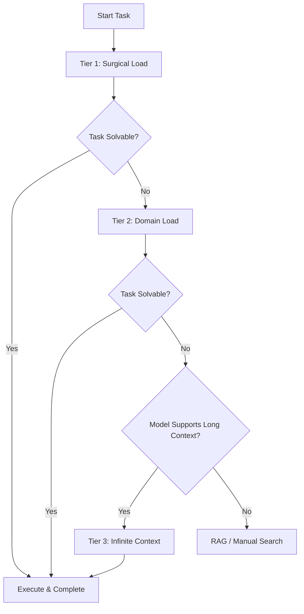

# Context Strategy: Tiered Loading

> [!IMPORTANT]
> Context management is not one-size-fits-all. We use a **Tiered Strategy** that scales from efficient outlines (Claude-style) to full repository cognition (Gemini-style) based on task needs and model capabilities.

---

## 1. The "Zoom" Metaphor

Agents should operate like a map application:
- **Zoom In**: High detail, narrow scope (Efficient Editing)
- **Zoom Out**: Low detail, broad scope (Architectural Awareness)
- **Street View**: Infinite detail, broad scope (Deep Debugging - *Expensive*)

---

## 2. Context Loading Tiers

### Tier 1: Efficient / Surgical (Default)
**Best for**: Feature implementation, known bug fixes, standard refactors.
**Strategy**:
- **Load**: `implementation_plan.md`, `task.md`, active files.
- **Method**: Outline-first (`view_file_outline`), then specific code blocks (`view_code_item`).
- **Cost**: Low ($)
- **Speed**: Fast (< 5s)

### Tier 2: Domain Awareness
**Best for**: Module-level refactoring, API changes.
**Strategy**:
- **Load**: All files in the specific package/module.
- **Method**: Full file loading for the active domain, outlines for neighbors.
- **Cost**: Medium ($$)
- **Speed**: Moderate (~10s)

### Tier 3: Infinite Context (Deep Debugging)
**Best for**: "I don't know where the bug is", global pattern search, complex integration issues.
**Strategy**:
- **Load**: Entire repository (or massive subsets like `backend/**`).
- **Method**: No summarization. Load raw source to find hidden dependencies.
- **Cost**: High ($$$)
- **Speed**: Slow (10s - 30s)
- **Requirement**: Must use a Long-Context Model (Gemini Pro, Claude Opus).

---

## 3. The Progressive Protocol

Always start at **Tier 1**. Escalate only when needed.

---

## 4. Model-Specific Adapters

Check `.ai/adapters/` for optimization tips:

- **Claude / Standard Models**: See `adapters/standard_context/efficient_loading.md`
- **Gemini / Long Context Models**: See `adapters/long_context/infinite_context.md`

---

## 5. RAG vs Long Context

| Use Case | Recommended Tool |
|----------|------------------|
| Locating a specific string | `grep_search` |
| Finding "how we did X in the past" | RAG / `search_web` (if docs indexed) |
| Understanding call flow across 20 files | **Tier 3 Context** |
| Checking API contract details | **Tier 1 Context** (view file) |
