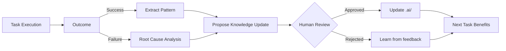

# Agent Self-Improvement & Learning Loops

> [!IMPORTANT]
> The best AI-native knowledge bases are **living systems** that evolve through agent experience. This document defines protocols for agent-driven knowledge improvement.

---

## 1. The Learning Loop Framework



---

## 2. Knowledge Update Triggers

### Automatic Triggers
| Event | Action | Example |
|-------|--------|---------|
| Same error pattern 2+ times | Create `knowledge/<pattern>.md` | Import cycle detected repeatedly |
| Novel solution discovered | Propose to `prompts/` or `guidelines/` | New debugging technique |
| Documentation mismatch | Update `docs/` | API changed but docs stale |

### Agent-Initiated Proposals
When an agent discovers something valuable:

```markdown
## Knowledge Update Proposal
**Type**: New Pattern / Update Existing / Deprecate
**Target File**: `.ai/knowledge/hybrid_storer_issues.md`
**Summary**: Discovered additional edge case with HybridStorer when...
**Evidence**: 
- Task ID where this was encountered
- Code snippets showing the issue
- Solution that worked
**Confidence**: High/Medium/Low
```

---

## 3. The Reflection Protocol

After completing any significant task, agents should perform reflection:

### Post-Task Reflection Template
```markdown
## Reflection: [Task Name]

### What Worked Well?
- [Specific technique or approach]

### What Caused Friction?
- [Obstacles encountered]
- [Time sinks]

### Surprising Discoveries?
- [Unexpected behaviors or learnings]

### Knowledge Gap Identified?
- [ ] No gaps found
- [ ] Gap found — Proposal: [link or description]

### Process Improvement?
- [ ] Current process sufficient
- [ ] Suggest: [improvement to workflow]
```

---

## 4. Knowledge Quality Metrics

### Freshness Score
```
Freshness = 1.0 - (days_since_update / max_staleness_days)
```
- Guidelines: max_staleness = 90 days
- Knowledge: max_staleness = 30 days (more volatile)

### Utility Score
Track when knowledge is:
- **Referenced**: Agent loaded this file
- **Applied**: Agent used a pattern from this file successfully
- **Contradicted**: Agent found this guidance incorrect

```
Utility = (applications * 2 + references) / (contradictions * 3 + 1)
```

### Suggested Actions by Score
| Freshness | Utility | Action |
|-----------|---------|--------|
| Low | Low | Archive or delete |
| Low | High | Update urgently |
| High | Low | Monitor or demote |
| High | High | Exemplary — promote |

---

## 5. Knowledge Categories & Lifecycle

### Lifecycle Stages
```
┌─────────────┐     ┌─────────────┐     ┌─────────────┐
│  Emerging   │ ──▶ │   Stable    │ ──▶ │  Archived   │
│  (future/)  │     │  (active)   │     │ (archive/)  │
└─────────────┘     └─────────────┘     └─────────────┘
     ▲                    │                    │
     │                    ▼                    │
     └──── Rejected  ◀── Review ◀─────────────┘
```

- **Emerging**: Proposals in `.ai/future/` awaiting review
- **Stable**: Approved knowledge in `.ai/guidelines/`, `.ai/knowledge/`
- **Archived**: Obsolete patterns, kept for historical reference

---

## 6. Human-in-the-Loop Governance

### What Requires Human Approval
- ✅ Any deletion of existing knowledge
- ✅ Changes to core `guidelines/` files
- ✅ New `personas/` definitions
- ✅ Architectural pattern changes

### What Agents Can Auto-Update
- ⚡ `knowledge/` with new debugging learnings (append-only)
- ⚡ Typo fixes in documentation
- ⚡ Adding examples to existing patterns

---

## 7. Implementation Recommendations

### For GitGym
1. Create `.ai/meta/changelog.md` — Track all knowledge updates
2. Add `Last Reviewed: YYYY-MM-DD` header to each file
3. Implement periodic "Knowledge Audit" prompts

### File Header Template
```markdown
---
last_reviewed: 2025-12-28
confidence: high
utility_score: 0.85
---
# Document Title
...
```

---

## 8. Anti-Patterns

- ❌ **Knowledge Hoarding**: Agent learns but never proposes updates
- ❌ **Overconfident Updates**: Changing guidelines based on single case
- ❌ **Stale Proposals**: `future/` files never reviewed or cleaned
- ❌ **Circular Wisdom**: Documenting obvious things ("use git commit to commit")

