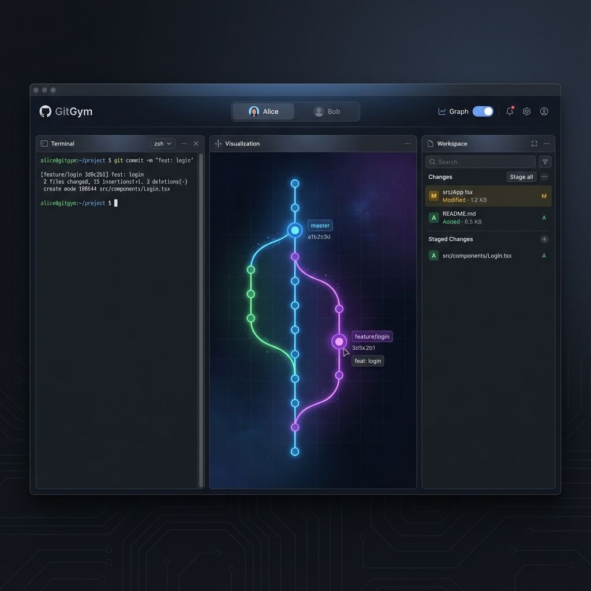

# GitGym 🏋️‍♂️

GitGym is an interactive, visual sandbox for learning and experimenting with Git commands. It provides a real-time visualization of the Git graph structure alongside a functional terminal interface, allowing users to see exactly how their commands affect the repository state.

> [!TIP]
> **For AI Agents (Gemini/Claude)**: Please refer to [.ai/context.md](.ai/context.md) for architectural guidelines and project context. This codebase is "GenAI Native", optimized for agentic reasoning and modification.



## 🚀 Features

- **Interactive Terminal**: A fully functional web-based terminal (Xterm.js) to run Git commands.
- **Real-time Visualization**: Instantly see commits, branches, and HEAD movement as you type, powered by **Framer Motion** for premium animations.
- **Sandboxed Environment**: Experiment safely without affecting your actual projects.
- **Command Support**:
  - `git init`, `status`, `add`, `commit`
  - `git branch`, `checkout`, `switch`
  - `git log`, `diff`
  - `git tag`, `reset`, `clean`, `revert`, `cherry-pick`
  - `git merge`, `rebase` (basic support)
  - `git clone`, `fetch`, `pull`, `push` (Simulated Remote)

- **Remote Simulation**: 
    - **Multi-Developer Support**: Simulate "Alice" and "Bob" working on the same repo with independent sessions.
    - **Shared Remote**: In-memory remote repository allowing real collaboration simulation (push/pull between users).
    - **Ingest Remote**: Clone and mirror any public GitHub repository (Mirror Mode) with support for large repos.

## 🏗 Architecture

GitGym is built with a modern, modular stack designed for maintainability and performance.

### Frontend (`/frontend`)
- **Framework**: React 19 + TypeScript + Vite
- **Styling**: Vanilla CSS Variables (Tokens) for consistent theming (Light/Dark).
- **State**: `GitAPIContext` (Flux-like) with strict memoization for performance.
- **Terminal**: Xterm.js with customized hook architecture (`useTerminal`, `useTerminalTranscript`).
- **Hygiene**: Strict ESLint rules (No `any`, No unused vars).

### Backend (`/backend`)
- **Language**: Go 1.25+
- **Core**: `go-git`
- **Pattern**: Command Pattern encapsulated commands.
- **Security**: `gosec` compliant, strict timeouts, input validation.
- **Hygiene**: `golangci-lint` (strict mode: `errcheck`, `shadow`, `staticcheck`).

## 🛠 Getting Started

### Quick Start
1. Clone the repository:
   ```bash
   git clone https://github.com/kurobon/gitgym.git
   cd gitgym
   ```
2. Start with Docker:
   ```bash
   docker compose up --build
   ```
3. Open [http://localhost](http://localhost).

### Development Setup
See [docs/setup/git_environment.md](docs/setup/git_environment.md).

## 🧪 Verification & Testing

We provide a unified script to ensure the codebase remains "GenAI Native" (clean, linted, and typed).

```bash
./scripts/test-all.sh
```

This script runs:
1.  **Backend Tests**: `go test ./...`
2.  **Backend Lint**: `golangci-lint run` (Strict)
3.  **Frontend Typecheck**: `tsc`
4.  **Frontend Lint**: `eslint .`

**Current Status**: 100% Pass (Zero Errors, Zero Warnings).

## 📂 Project Structure

```
gitgym/
├── .ai/                # AI Context & Prompts (Brain)
├── backend/            # Go backend service
│   ├── cmd/server/     # Entry point
│   └── internal/       # Application logic (Commands, State, Git)
├── frontend/           # React frontend
│   └── src/            # Source code (Components, Hooks, Context)
├── docs/               # Documentation
├── scripts/            # Utility scripts (Verification)
└── docker-compose.yml  # Orchestration
```

## 📄 License
MIT
